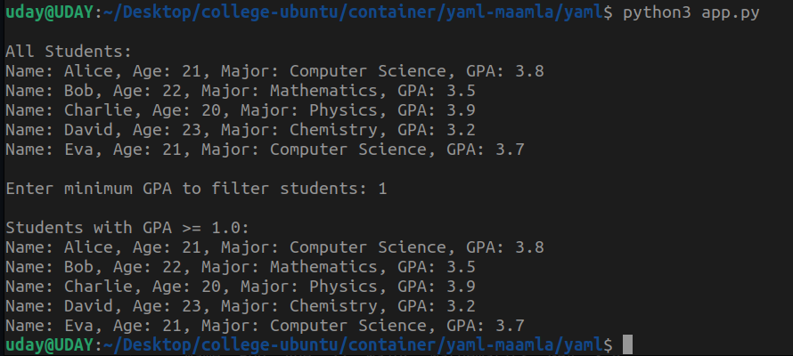

# YAML-Based Student Data Filtering

This project demonstrates how to use Python and YAML to store and filter student data based on GPA. We use the PyYAML library to load and parse a YAML file containing student information and apply filtering logic to display students with a GPA above a user-defined threshold.

## 1. What is YAML?
YAML (YAML Ain't Markup Language) is a human-readable data serialization format. It is commonly used for configuration files and data exchange between programming languages. YAML is designed to be simple and easy to understand compared to JSON and XML.

### YAML Syntax Basics:
- Uses indentation to represent structure (like Python)
- Key-value pairs (`key: value` format)
- Lists are represented with `-`
- Supports comments using `#`

#### Example YAML format:
```yaml
students:
  - name: Alice
    age: 21
    major: Computer Science
    gpa: 3.8
  - name: Bob
    age: 22
    major: Mathematics
    gpa: 3.5
```

## 2. Project Structure
The project consists of the following files:

- `app.py` (Python script to process YAML data)
- `students.yaml` (YAML file containing student data)
- `README.md` (This documentation)

## 3. Requirements
Before running the script, ensure you have PyYAML installed:
```sh
pip install pyyaml
```

## 4. Code Explanation

### `app.py`
This script reads student data from a YAML file, displays it, and allows filtering based on GPA.

```python
import yaml

def load_data(file_path):
    """
    Load data from a YAML file.
    :param file_path: Path to the YAML file.
    :return: Data loaded from the YAML file.
    """
    with open(file_path, 'r') as file:
        data = yaml.safe_load(file)  # Load the data as a Python dictionary
    return data

def display_students(students):
    """
    Display information about all students.
    :param students: List of student dictionaries.
    """
    print("\nAll Students:")
    for student in students:
        print(f"Name: {student['name']}, Age: {student['age']}, Major: {student['major']}, GPA: {student['gpa']}")

def filter_students_by_gpa(students, min_gpa):
    """
    Filter and display students with a GPA above the specified minimum.
    :param students: List of student dictionaries.
    :param min_gpa: Minimum GPA for filtering.
    """
    filtered_students = [s for s in students if s['gpa'] >= min_gpa]
    
    print(f"\nStudents with GPA >= {min_gpa}:")
    if filtered_students:
        for student in filtered_students:
            print(f"Name: {student['name']}, Age: {student['age']}, Major: {student['major']}, GPA: {student['gpa']}")
    else:
        print("No students found.")

def main():
    # Load the data from the YAML file
    data = load_data('students.yaml')
    students = data['students']
    
    # Display all students
    display_students(students)
    
    # Filter students by GPA
    min_gpa = float(input("\nEnter minimum GPA to filter students: "))
    filter_students_by_gpa(students, min_gpa)

if __name__ == "__main__":
    main()
```

### `students.yaml`
This file contains a list of students with their details.

```yaml
students:
  - name: Alice
    age: 21
    major: Computer Science
    gpa: 3.8
  - name: Bob
    age: 22
    major: Mathematics
    gpa: 3.5
  - name: Charlie
    age: 20
    major: Physics
    gpa: 3.9
  - name: David
    age: 23
    major: Chemistry
    gpa: 3.2
  - name: Eva
    age: 21
    major: Computer Science
    gpa: 3.7
```

## 5. Running the Program
To run the program, execute the following command in the terminal:

```sh
python app.py
```

You will see all students displayed, and then you can enter a GPA threshold to filter students.

## 6. Output
<p align="center">
  
</p>
## 7. Conclusion
This project demonstrates how to work with YAML in Python using the PyYAML library. YAML is a great format for configuration files, and this script showcases a practical example of data loading, processing, and filtering.

### Further Enhancements:
- Add more fields (e.g., student ID, email, etc.)
- Implement a feature to add new students dynamically
- Store the output results in a new YAML file

Happy Coding! 🚀
